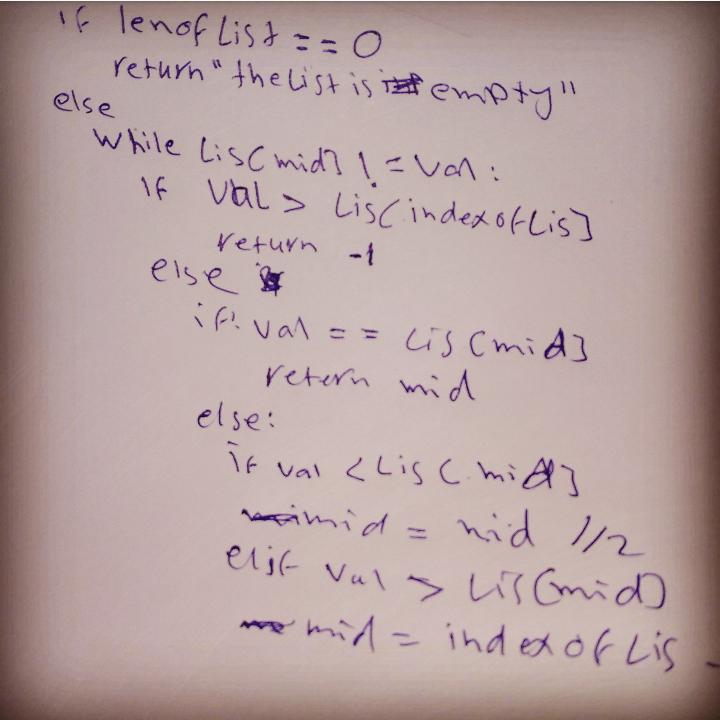

# BinarySearch

There are many method to to find the length of value inside list.

## Challenge

Without utilizing any of the built-in methods available to your language, return the index of the array’s element that is equal to the search key, or -1 if the element does not exist ,and your function must be as clean as possible.

## Approach & Efficiency

well i learn that i must solve the problem as easy as possible to make program responsive as fast as possible, that what we called **"Big O Notation"**.

## Solution

done
---

[Home](../../../README.md)
