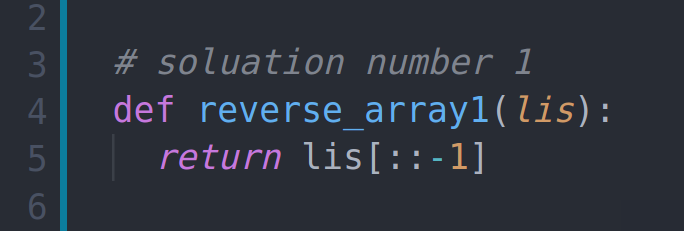

# Reverse an Array

There are many method to reverse list in python.

## Challenge

in this challenge you will write function that take an argument and its must return it as reverse and your and your function must be as clean as possible.

## Approach & Efficiency

well i learn that i must solve the problem as easy as possible to make program responsive as fast as possible, that what we called **"Big O Notation"**.

## Solution

done
---

[Home](../../../README.md)
