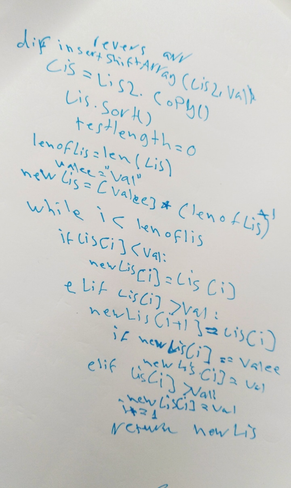

# Reverse an Array

 There are many method to add val into list in python.

## Challenge

 in this challenge you will write function that take tow argument first is list of number and the secound is value as number and its must return new list that list must add the value to the first list and sort the new list from smaller to greater one.

`note:` we must do it with out use bilt in method()

## Approach & Efficiency

 well i learn that i must solve the problem as easy as possible to make program responsive as fast as possible, and with reduce the siza of the program as storage
 that what we called **"Big O Notation"**.

 and i use TDD/Test Driven Development by write function to test my code and give me 
 

``` 
 red green refctor
 ```

## Solution

 



 done
---

[Home](../../../README.md)
