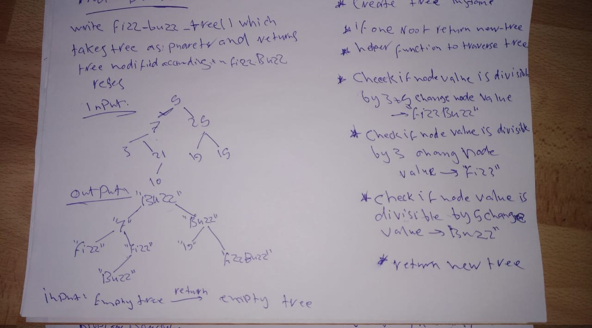

# FizzBuzz Tree.

## Challenge

Conduct “FizzBuzz” on a tree while traversing through it. Change the values of each of the nodes dependent on the current node’s value. Return a new tree with the changed values.

## Approach & Efficiency

For the fizz_buzz_tree fucntion:
Time Big O(N)
Space Big O(N\*tree_height)

## Solution

