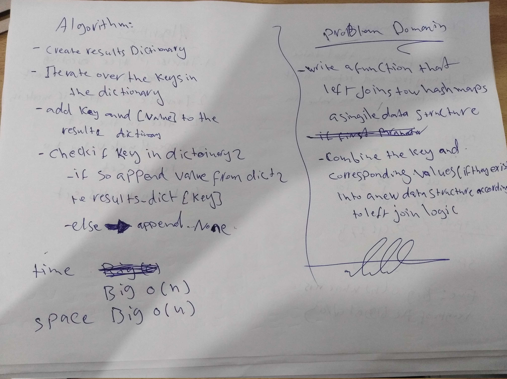

# Hashmap Left Join

## Author: Ahmad Swedani

## Challenge
Implement a simplified LEFT JOIN for 2 Hashmaps.
For this challenge we assumed that our input is 2 dictionaries because internally dictionaries implemented as a hashmaps in python

## Approach & Efficiency
Time Big O(n)
Space Big O(n)

## Input:
### Synonym Dicitionary

| Key         | Value       |
| ----------- | ----------- |
| fond        | enamored    |
| wrath       | anger       |
| diligent    | employed    |
| outfit      | garb        |
| guide       | usher       |
...

### Antonym Dictionary

| Key         | Value       |
| ----------- | ----------- |
| fond        | averse      |
| wrath       | delight     |
| diligent    | idle        |
| guide       | follow      |
| flow        | jam         |
...

## Output:
{ 
"fond": ["enamored","averse"],
"wrath": ["anger","delight"],
"diligent": ["employed","idle"],
"outfit": ["garb",None],
"guide": ["usher","follow"] 
}

## Solution

