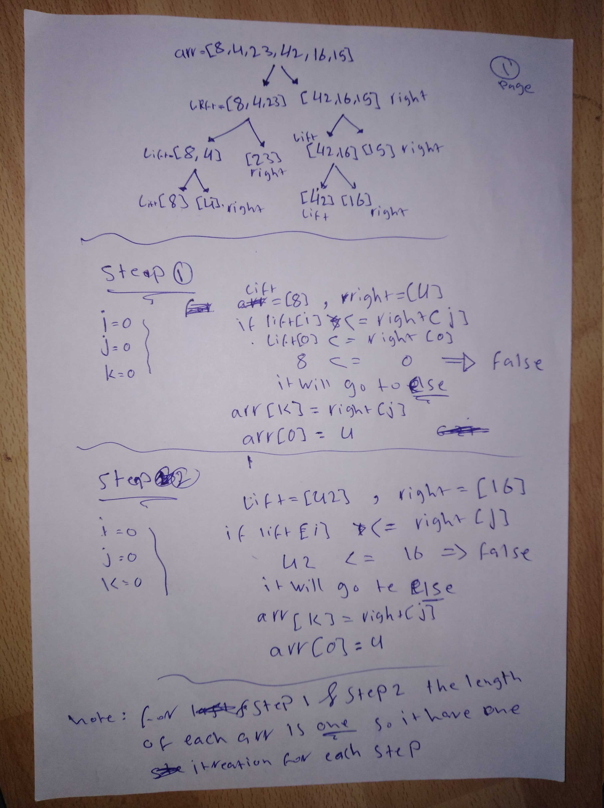
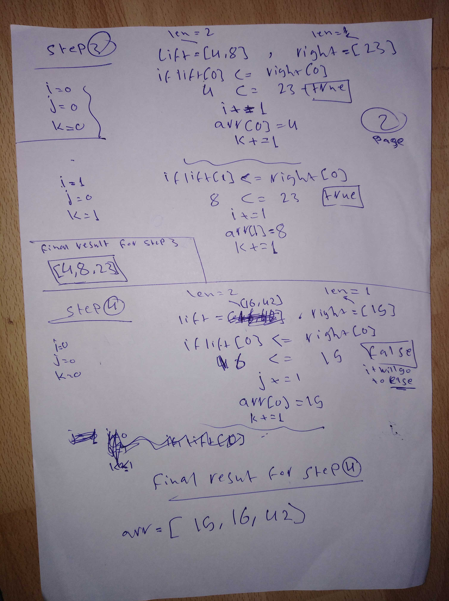
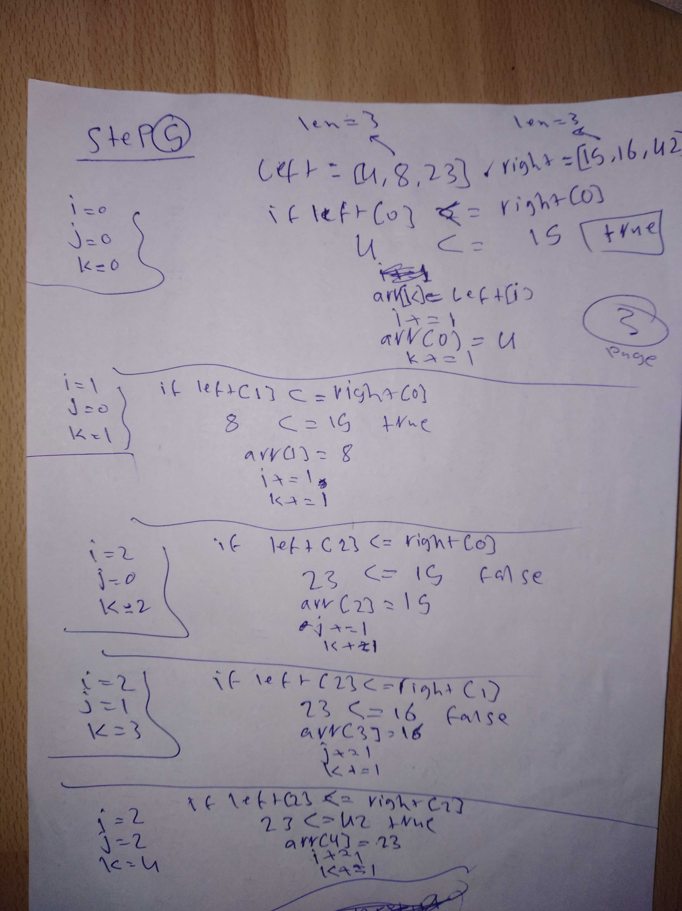

# merge Sort

Merge sort is one of many kind of sorting, we start with split the origin list from the middle to lift and right (as tree ) and still doing that with recurrence until we get every index Separate list after that we will start compare the index 0 of lift list with index 0 if right list and sort the number

1. Merge sorts a fast but require a big amount of memory.
1. Merge Sort is useful for sorting linked lists.
1. Merge Sort is a stable sort which means that the same element in an array maintain their original positions with respect to each other.

### Pseudocode

```markdown
---
ALGORITHM Mergesort(arr)
DECLARE n <-- arr.length

if n > 1
DECLARE mid <-- n/2
DECLARE left <-- arr[0...mid]
DECLARE right <-- arr[mid...n]
// sort the left side
Mergesort(left)
// sort the right side
Mergesort(right)
// merge the sorted left and right sides together
Merge(left, right, arr)

ALGORITHM Merge(left, right, arr)
DECLARE i <-- 0
DECLARE j <-- 0
DECLARE k <-- 0

while i < left.length && j < right.length
if left[i] <= right[j]
arr[k] <-- left[i]
i <-- i + 1
else
arr[k] <-- right[j]
j <-- j + 1

k <-- k + 1

if i = left.length
set remaining entries in arr to remaining values in right
else
set remaining entries in arr to remaining values in left
---
```

### Trace

---

`array before sort : [8,4,23,42,16,15]`

##### Pass 1



Our function merge sort recursivly devides our list by half, than its left and right part on half and so on. at the same time inside each mege_sort() function call we are calling merge() function and passing to it the current left, right, and part of the list. The merge() function should merge in proper order all element from left and right sequences.

our merge \\left,right,arr// function will start from the bottom of our "tree".`[8]` will be lift list ,`[4]`right list,`[8,4]` the new arr.after merging `8` and `4`, our arr will be `[4,8]`

also for the right the arr `[42,16]`, will be `[16,42]`

##### Pass 2



again nerge() will be called with `([4,8],[32],[4,8,32])` as parameters. after merging our arr will still `[4,8,32]`.

also Merge will be called with `([16,42], [15], [16, 42, 15])` as parameters. After merging and proper ordering our lst became `[15, 16, 42]`

##### Pass 3



Now our "tree" has two ordered sublists. Call merge last tme with this sublists and our list as parameters. Our lists merged and all elements are ordered.

`array after sort: [4, 8, 15, 16, 23, 42]`

## Efficiency

- Space complexity Big O(n)
- Time complexity Big O(n\*log(n))
