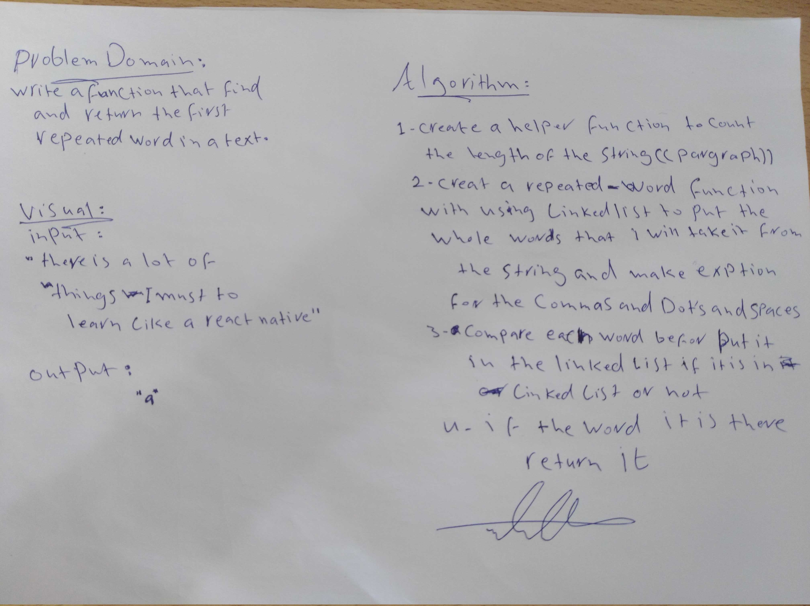

# Challenge Summary

Write a function that accepts a lengthy string parameter. Without utilizing any of the built-in library methods available to your language, return the first word to occur more than once in that provided string.

# Approach & Efficiency

created a function that takes a paragraph and splits the paragraph count repetition for every word, exception the spaces and commas and dots without using any library frome your language 

# Solution

