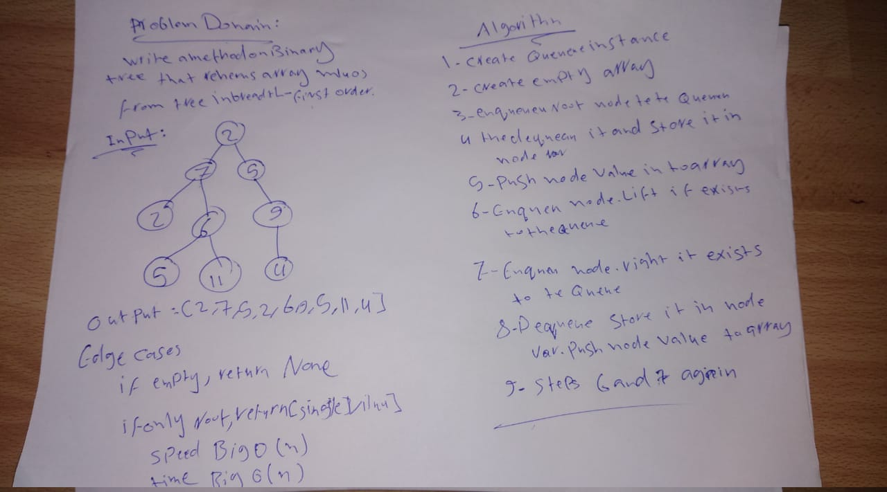
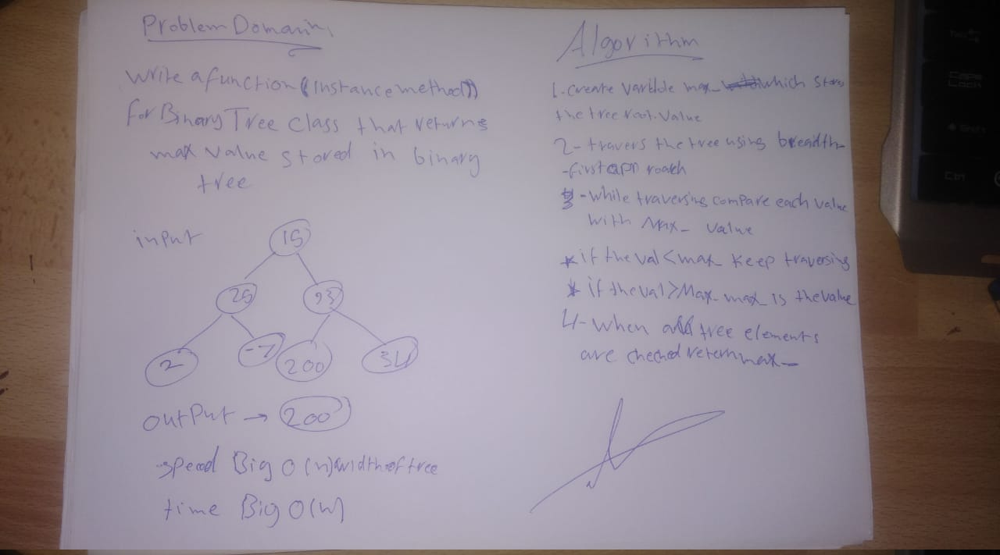
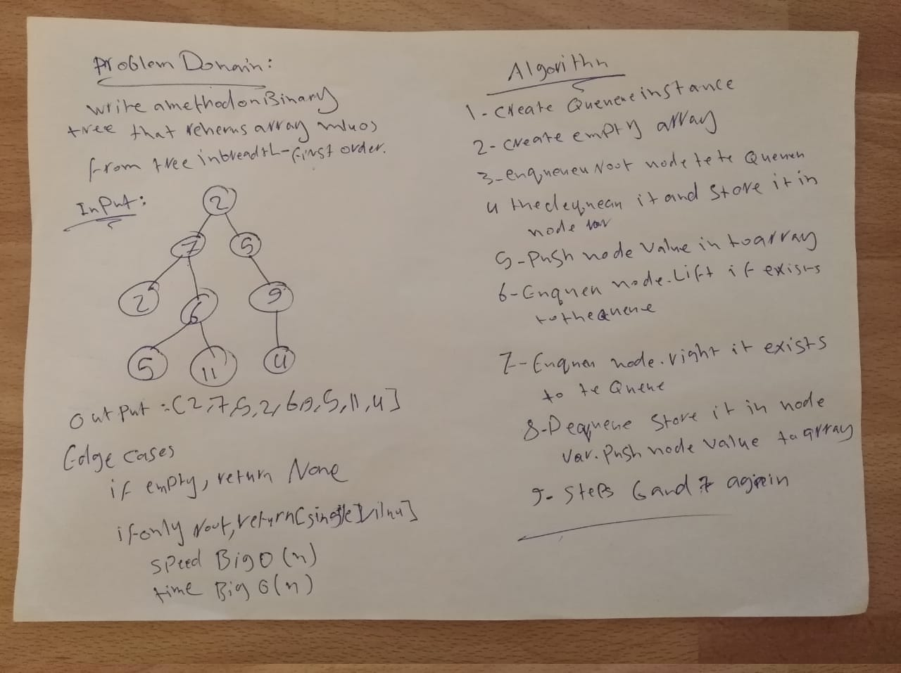

# Binary Tree :

## Challenge

Tree one of the most famous data structres in the world .. and there is many ways to implement it..

## Approach & Efficiency

well for me .. i learned alot that is alot ways to slove proplem but always the best solution is which dosent need alot of time and memory to excute and get you the answer..
no mater how data you had..or even in worst case it is!!

## API

BinaryTree():

- .pre_order() - BinaryTree method to return an array of trre values in "pre-order" order
- .in_order() - BinaryTree method to return an array of tree values "in-order"
- .post_order() - BinaryTree method to return an array of tree values "post-order

BinarySearchTree(BinaryTree):

- .add(value) - BinarySearchTree method that accepts a value, and adds a new node with that value in the correct location in the binary search tree
- .contains(value) - BinarySearchTree method that accepts a value, and returns a boolean indicating whether or not the value is in the tree at least once.

## Solution



> ## Note: Done with Emad AL Zo3bi as pair programing..

---

# Find the Maximum Value in a Binary Tree

## Challenge

Write an instance method called find-maximum-value. Without utilizing any of the built-in methods, return the maximum value stored in the tree. You can assume that the values stored in the Binary Tree will be numeric.

## Approach & Efficiency

Time Big O(n)
Space Big O(W) where W - Width of the tree because we are using Queue through traversiong of our tree

## Solution



> note:you need to write this to make the test work:

```
poetry add binarytree
```

---

# Breadth First Traversal :

## Challenge

Tree one of the most famous data structres in the world .. and there is many ways to implement it.. and this metohd is writen to return list of 'Breadth First Traversal' in the order they were encountered

## Approach & Efficiency

The most efficent way to keep track of each node on each level before moving on has to be by using a queue. When a node is reached that means that it is at the front of the queue. So it is then safe to remove it from the queue -- dequeue it.. When we remove the node from the queue, we want to take its value and append it to our list that is keeping track of all the values in the binary tree (breadth first). Additionally we need to add any and all the immediate children of the dequeued node to the end of the queue -- enqueue them.

## Solution


